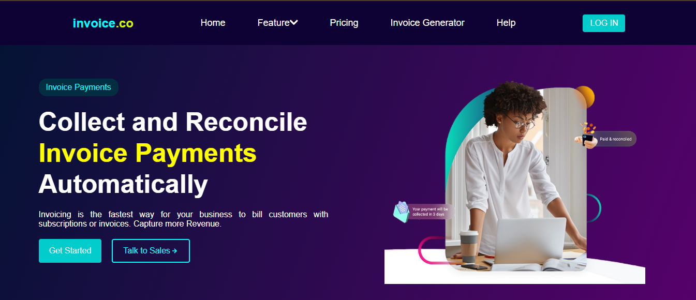
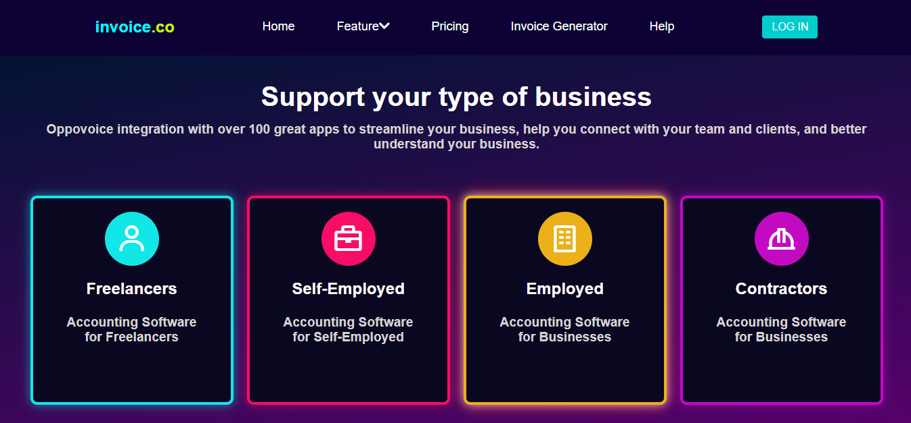
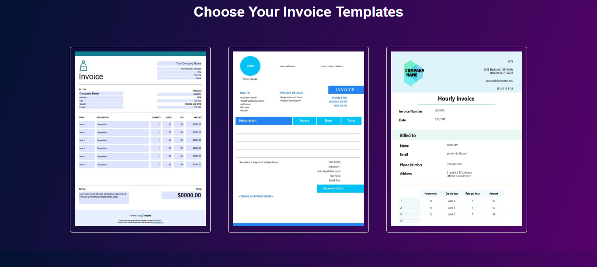
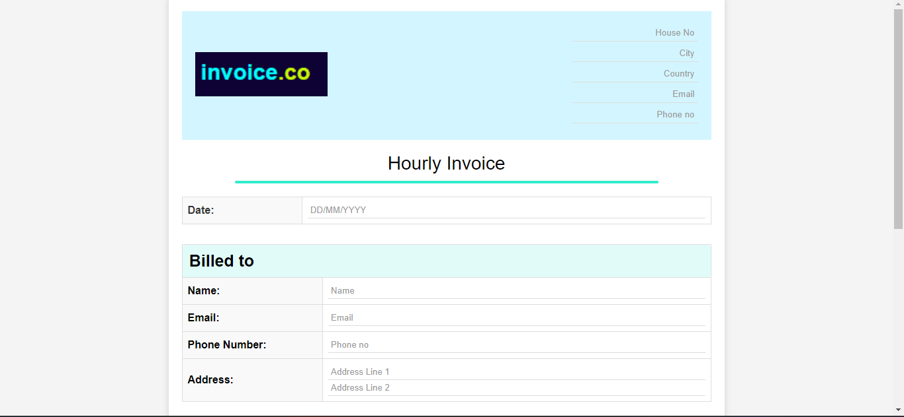
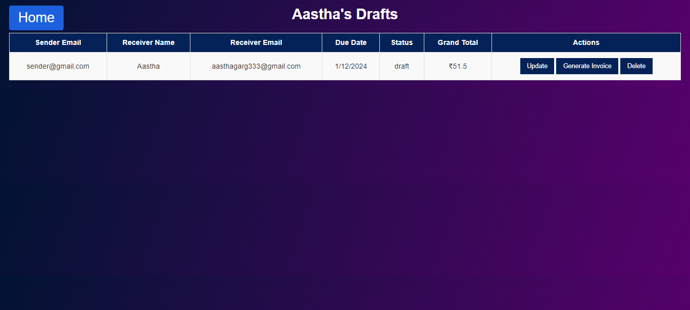
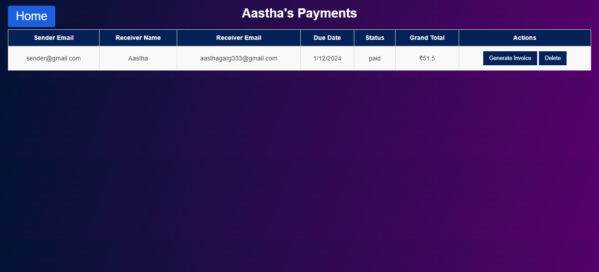
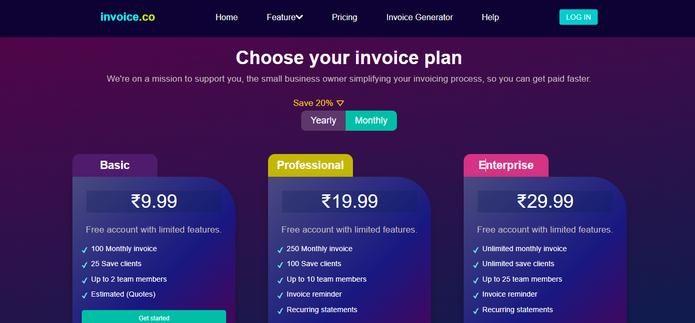

# Dynamic Invoice Generator


Welcome to the **Dynamic Invoice Generator**, a web application built with Flask, HTML, CSS, and JavaScript that allows users to create and manage invoices according to their business type and subscription preferences.

## Features

- **Invoice Creation**: Generate invoices tailored to your business needs.
- **Subscription Options**: Choose from various subscription plans that best suit your business.
- **Manage Invoices**: Keep track of all your invoices in one place.
- **Responsive Design**: Optimized for all devices to provide a seamless user experience.

## Technologies Used

- **Backend**: Flask
- **Frontend**: HTML, CSS, JavaScript

## Screenshots

### Home Page


### Business Type


### Templates


### Create Invoice


### Manage Invoice


### Paid Invoice


### Subscription Options


## Getting Started

### Prerequisites

Make sure you have the following installed on your local machine:

- Python 3.x
- pip (Python package installer)
- Virtualenv (optional but recommended)

### Installation

1. **Clone the repository**:

   ```bash
   git clone https://github.com/yourusername/dynamic-invoice-generator.git
   ```

2. **Navigate to the project directory**:

   ```bash
   cd dynamic-invoice-generator
   ```

3. **Create a virtual environment** (optional but recommended):

   ```bash
   python -m venv venv
   ```

4. **Activate the virtual environment**:

   - On Windows:

     ```bash
     venv\Scripts\activate
     ```

   - On macOS/Linux:

     ```bash
     source venv/bin/activate
     ```

5. **Install the dependencies**:

   ```bash
   pip install -r requirements.txt
   ```

### Running the Application

1. **Start the Flask development server**:

   ```bash
   flask run
   ```

2. **Open your browser and navigate to** `http://localhost:5000`.

## Usage

- **Create Invoices**: Navigate to the invoice creation page and fill in the necessary details to generate an invoice tailored to your business.
- **Manage Subscriptions**: Choose from various subscription plans and manage your preferences.
- **View and Manage Invoices**: Access the invoice management section to view and keep track of all your invoices.

## Project Structure

```
dynamic-invoice-generator/
├── README.md
├── __pycache__/
│   ├── config.cpython-310.pyc
├── app.py
├── app/
│   ├── __init__.py
│   ├── __pycache__/
│   ├── admin.py
│   ├── forms.py
│   ├── models.py
│   ├── routes.py
│   ├── static/
│   │   ├── css/
│   │   │   ├── all.min.css
│   │   │   ├── bootstrap.min.css
│   │   │   ├── forms.css
│   │   │   ├── index.css
│   │   ├── images/
│   │   │   ├── 404.png
│   │   │   ├── Linkedin.png
│   │   │   ├── Microsoft.png
│   │   │   ├── amazon.png
│   │   │   ├── feature.png
│   │   │   ├── hubspot.png
│   │   │   ├── img1.png
│   │   │   ├── logo.png
│   │   │   ├── mastercard.png
│   │   │   ├── paypal.png
│   │   │   ├── paytm.png
│   │   │   ├── qa.png
│   │   │   ├── symntec.png
│   │   │   ├── template1.jpg
│   │   │   ├── template2.jpg
│   │   │   ├── template3.jpg
│   │   │   ├── testi2.jpg
│   │   │   ├── testi3.jpg
│   │   │   ├── testi4.jpg
│   │   │   ├── testi5.png
│   │   │   ├── visa.png
│   │   ├── js/
│   │   │   └── index.js
│   ├── templates/
│   │   ├── 404.html
│   │   ├── change_password.html
│   │   ├── change_password_base.html
│   │   ├── change_profile.html
│   │   ├── changeprofilebase.html
│   │   ├── draft_invoices.html
│   │   ├── index.html
│   │   ├── index_base.html
│   │   ├── invoice_template.html
│   │   ├── login.html
│   │   ├── loginsignupbase.html
│   │   ├── profilbase.html
│   │   ├── profile1.html
│   │   ├── search.html
│   │   ├── signup.html
│   │   ├── subscribe_base.html
│   │   ├── subscription.html
│   │   ├── template.html
│   │   ├── template3.html
│   │   ├── template3_print.html
│   │   ├── template3_update.html
│   │   ├── userprofile.html
│   │   ├── usetemplate.html
|   ├── instance/
|       ├── site.db
├── assets/
│   ├── Home.png
|   ├──Subscription.png
|   ├──Create.png
|   ├──Manage Invoice
├── requirements.txt
├── run.py

```

## Contributing

We welcome contributions from the community! If you'd like to contribute, please follow these steps:

1. Fork the repository.
2. Create a new branch:

   ```bash
   git checkout -b feature/your-feature-name
   ```

3. Make your changes and commit them:

   ```bash
   git commit -m "Add your commit message"
   ```

4. Push to the branch:

   ```bash
   git push origin feature/your-feature-name
   ```

5. Open a pull request and describe your changes.

## License

No License

Thank you for using the **Dynamic Invoice Generator**! We hope it helps you manage your business invoices efficiently.
